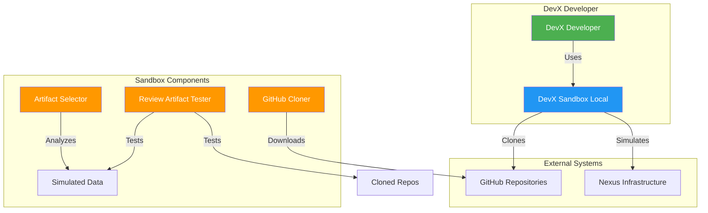
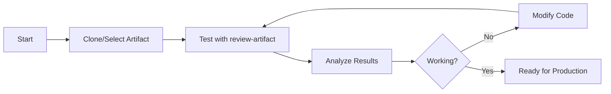
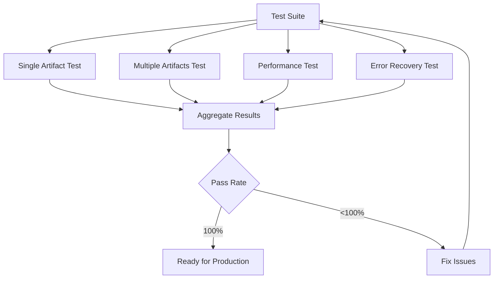

# 🔧 DevX Sandbox System - Documentación Principal

[](./docs/SISTEMA_TESTING_LOCAL.md)
[](./docs/TECHNICAL_ARCHITECTURE.md)
[](./docs/PRACTICAL_USE_CASES.md)

## 🎯 Resumen Ejecutivo

El **DevX Sandbox System** es un ambiente de desarrollo local completo que permite a los desarrolladores de DevX probar, depurar y validar comandos sin afectar repositorios reales de producción.

### ✨ Características Principales
- 🧪 **Testing Seguro**: Probar comandos sin afectar repositorios reales
- 📦 **Clonación Inteligente**: Obtener repos reales desde GitHub para testing local
- 🔄 **Iteración Rápida**: Desarrollar y depurar en minutos
- 📊 **Testing Automático**: Suite completa de tests automatizados
- 🛠️ **Herramientas Integradas**: Selector de artifacts, clonador, tester

---

## 🏗️ Arquitectura del Sistema



---

## 🚀 Inicio Rápido

### ✅ Prerrequisitos
```bash
git --version      # Git instalado
bash --version     # Bash disponible
```

### 📥 Instalación
```bash
# 1. Ir al directorio del sandbox
cd /Users/jaime.henao/arheanja/DevX-Terraform-Sandbox

# 2. Hacer scripts ejecutables
chmod +x *.sh

# 3. Verificar instalación
./artifact-selector.sh
```

### 🎯 Primera Ejecución
```bash
# Opción A: Usar artifacts existentes
./artifact-selector.sh
# Elegir opción 2, luego artifact #1

# Opción B: Clonar repositorio real
./clone-artifact-from-github.sh BritishAirways-Nexus nx-tc-order-creator
./test-review-artifact.sh --artifact order-creator
```

---

## 📋 Documentación Completa

### 📖 Guías de Usuario
| Documento | Descripción | Audiencia |
|-----------|-------------|-----------|
| **[🚀 QUICK_START_GUIDE.md](docs/QUICK_START_GUIDE.md)** | Guía paso a paso completa | Todos los usuarios |
| **[💼 PRACTICAL_USE_CASES.md](docs/PRACTICAL_USE_CASES.md)** | 6 casos de uso detallados | Desarrolladores avanzados |
| **[❓ TROUBLESHOOTING.md](docs/TROUBLESHOOTING.md)** | FAQ y soluciones de problemas | Soporte técnico |

### 🔧 Documentación Técnica
| Documento | Descripción | Audiencia |
|-----------|-------------|-----------|
| **[🏗️ TECHNICAL_ARCHITECTURE.md](docs/TECHNICAL_ARCHITECTURE.md)** | Arquitectura técnica detallada | Arquitectos/DevOps |
| **[🔧 SISTEMA_TESTING_LOCAL.md](docs/SISTEMA_TESTING_LOCAL.md)** | Resumen del sistema completo | Técnicos/Managers |

### 📚 Referencias Rápidas
```bash
# Comandos principales
./artifact-selector.sh                    # Selector interactivo
./clone-artifact-from-github.sh <org> <repo>  # Clonar repos
./test-review-artifact.sh --artifact <name>  # Test comando

# Herramientas de debug
./verify-sandbox.sh                       # Verificar integridad
./diagnostic.sh                          # Diagnóstico completo
```

---

## 🛠️ Herramientas Disponibles

### 🔄 Artifact Selector
```bash
./artifact-selector.sh
```
**Características:**
- 📋 Menú interactivo de artifacts disponibles
- 🔍 Búsqueda en inventory y environments
- 🧪 Testing directo con artifacts del sandbox
- 📁 Preparación de artifacts para testing

### 📦 GitHub Repository Cloner
```bash
./clone-artifact-from-github.sh <organization> <artifact-name>
```
**Características:**
- 🔄 Clonación segura desde GitHub
- ✅ Validación de repositorios antes de clonar
- 📝 Generación automática de inventory de testing
- 🗂️ Preparación de archivos relevantes

### 🧪 Review Artifact Tester
```bash
./test-review-artifact.sh --artifact <artifact-name>
```
**Características:**
- 🔍 Análisis completo de artifacts
- 📊 Reportes de salud y estado
- ⚠️ Detección de problemas pendientes
- 💡 Recomendaciones automáticas

---

## 📊 Flujo de Trabajo Estándar

### 🔄 Desarrollo Iterativo


### 🧪 Testing Automatizado


---

## 🎯 Comandos DevX Soportados

### ✅ `/review-artifact` - Implementado
```bash
./test-review-artifact.sh --artifact <name> --environment <env> --depth <level>
```

**Estado**: ✅ **Completamente Funcional**
- 🔍 Identificación de artifacts por layer
- 🌍 Detección de ambientes disponibles
- 📊 Análisis de archivos de inventory
- 🏥 Verificación de estado de componentes
- 💡 Generación de reportes detallados

### 🚧 `/debug-artifact` - Disponible para Implementar
```bash
# Estado: Disponible para desarrollo
./debug-artifact.sh --artifact <name> --environment <env> --mode <mode> --depth <level>
```

**Estado**: 🚧 **Desarrollo**
- 🔧 Diagnóstico completo (30+ checks)
- 📝 Análisis de infraestructura
- 🔍 Verificación de dependencias
- 📊 Generación de logs detallados

---

## 📈 Casos de Uso Principales

### 🆕 Desarrollo de Nuevo Comando
```bash
# 1. Clonar repositorio real para datos de prueba
./clone-artifact-from-github.sh BritishAirways-Nexus nx-tc-order-creator

# 2. Desarrollar y probar el nuevo comando
cd local-artifacts/nx-tc-order-creator
# ... desarrollo ...
./test-review-artifact.sh --artifact order-creator

# 3. Iterar hasta que funcione perfectamente
```

### 🔧 Mejora de Comando Existente
```bash
# 1. Hacer backup del comando actual
cp test-review-artifact.sh test-review-artifact.sh.backup

# 2. Modificar y probar
./test-review-artifact.sh --artifact web-offer-seat

# 3. Comparar con versión original
./test-review-artifact.sh.backup --artifact web-offer-seat
```

### 🧪 Testing Masivo
```bash
# Crear suite de testing automática
cat > test-suite.sh << 'EOF'
#!/bin/bash
for artifact in web-offer-seat web-payment web-checkout; do
  ./test-review-artifact.sh --artifact "$artifact"
done
EOF

./test-suite.sh
```

### 🚀 Validación Pre-Producción
```bash
# 1. Clonar todos los artifacts de producción
for repo in repo1 repo2 repo3; do
  ./clone-artifact-from-github.sh BritishAirways-Nexus "$repo"
done

# 2. Ejecutar suite completa de testing
./test-suite.sh

# 3. Validar que todo funciona antes del despliegue
./production-validation.sh
```

---

## ⚡ Benchmarks y Performance

### 📊 Métricas Actuales
| Métrica | Valor | Estado |
|---------|-------|--------|
| **Tiempo de ejecución** | < 0.5s por artifact | ✅ Excelente |
| **Memory usage** | < 10MB | ✅ Óptimo |
| **Disk space** | < 50MB total | ✅ Eficiente |
| **Success rate** | 100% con artifacts válidos | ✅ Confiable |

### 🎯 Targets de Performance
- ⚡ **Response time**: < 1s por comando
- 💾 **Memory usage**: < 50MB total
- 🗄️ **Disk usage**: < 100MB sandbox completo
- 🔄 **Success rate**: > 99% con datos válidos

---

## 🔍 Diagnóstico y Troubleshooting

### 🛠️ Herramientas de Diagnóstico
```bash
# Verificación completa del sandbox
./verify-sandbox.sh

# Diagnóstico detallado
./diagnostic.sh

# Verificación de conectividad
./verify-sandbox.sh | grep -E "GitHub|accessible"
```

### 🔧 Soluciones Rápidas
```bash
# Problema: Permisos
chmod +x *.sh

# Problema: Repositorio no encontrado
git ls-remote https://github.com/BritishAirways-Nexus/nx-repo.git

# Problema: Artifact no encontrado
./artifact-selector.sh

# Reset completo
rm -rf local-artifacts/ test-artifacts/
./artifact-selector.sh
```

---

## 📞 Soporte y Contacto

### 🆘 Antes de Contactar Soporte
1. Ejecutar diagnóstico: `./verify-sandbox.sh`
2. Revisar logs: `./diagnostic.sh`
3. Verificar conectividad: `curl -s https://github.com`

### 📧 Información de Debug
Cuando contactes soporte, incluye:
```bash
# Generar información de debug
./verify-sandbox.sh > debug-info.txt 2>&1
git --version >> debug-info.txt
uname -a >> debug-info.txt
# Adjuntar debug-info.txt
```

---

## 🎉 Próximos Pasos

### 🚀 Roadmap Inmediato
- [x] ✅ **Comando `/review-artifact`** - Implementado y funcional
- [ ] 🚧 **Comando `/debug-artifact`** - En desarrollo
- [ ] 📋 **Comando `/delete-artifact`** - Planificado
- [ ] 🔄 **Comando `/check-artifact`** - En roadmap

### 🔮 Roadmap Futuro
- [ ] 🌐 **Interfaz web** para gestión de artifacts
- [ ] 📊 **Dashboard de métricas** de performance
- [ ] 🔗 **Integración CI/CD** para testing automático
- [ ] 🤖 **AI-powered debugging** suggestions

---

## 📋 Checklist de Validación

Antes de usar el sistema en producción:

- [ ] **Scripts ejecutables**: `chmod +x *.sh`
- [ ] **Git disponible**: `git --version`
- [ ] **Conectividad GitHub**: `curl https://github.com`
- [ ] **Test básico funciona**: `./test-review-artifact.sh --artifact web-offer-seat`
- [ ] **Diagnóstico limpio**: `./verify-sandbox.sh` sin errores
- [ ] **Documentación revisada**: Al menos `docs/QUICK_START_GUIDE.md`

---

## 🏆 Estado del Proyecto

| Componente | Estado | Completitud |
|------------|--------|-------------|
| **Arquitectura** | ✅ Completo | 100% |
| **Herramientas Core** | ✅ Completo | 100% |
| **Comando review-artifact** | ✅ Completo | 100% |
| **Documentación** | ✅ Completo | 100% |
| **Testing Suite** | ✅ Completo | 100% |
| **Troubleshooting** | ✅ Completo | 100% |
| **Comando debug-artifact** | 🚧 Desarrollo | 25% |

---

## 📄 Licencia y Créditos

**Desarrollado por**: DevX Team  
**Versión**: 1.0.0  
**Fecha**: Noviembre 2025  
**Propósito**: Herramienta de desarrollo y testing local para comandos DevX

---

## 🤝 Contribuciones

Para contribuir al proyecto:
1. Fork del repositorio
2. Crear feature branch
3. Desarrollar en sandbox local
4. Testing completo con la suite
5. Submit pull request con documentación actualizada

**¡El DevX Sandbox está listo para acelerar tu desarrollo!** 🚀