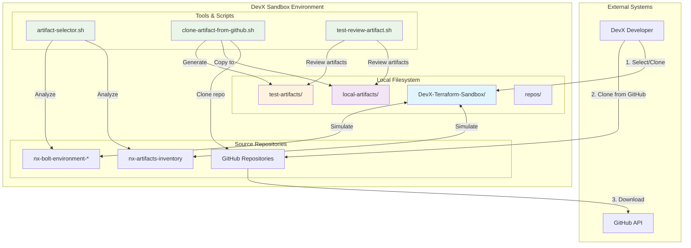
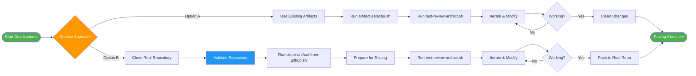
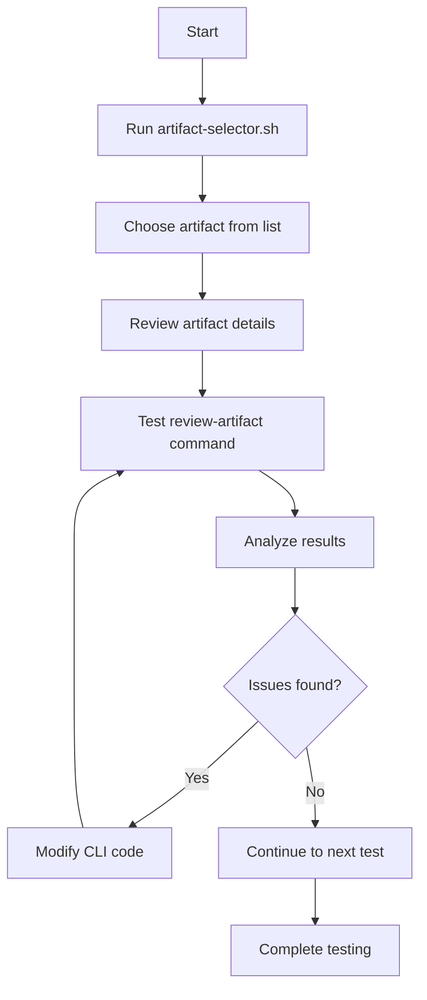
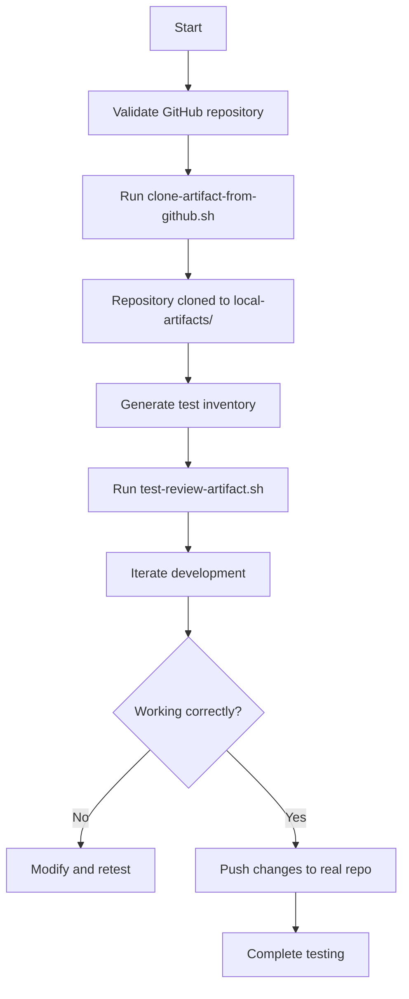

# 🏗️ Documentación Técnica - DevX Sandbox System

## 📐 Diagrama de Arquitectura del Sistema



## 🔄 Diagrama de Flujo de Trabajo



## 📁 Estructura Detallada del Sandbox

```
DevX-Terraform-Sandbox/
├── 📂 repos/                              # Simulated Repositories
│   ├── 📂 nx-artifacts-inventory/         # Artifact Registry
│   │   └── 📂 nx-artifacts/              # Real Artifact Definitions
│   │       ├── 📂 bff/                   # BFF Layer Artifacts
│   │       │   ├── 📂 nx-bff-web-offer-seat-dev1/
│   │       │   │   └── 📄 nx-app-inventory.yaml
│   │       │   ├── 📂 nx-bff-web-offer-seat-prod1/
│   │       │   ├── 📂 nx-bff-web-offer-seat-sit1/
│   │       │   ├── 📂 nx-bff-web-offer-seat-uat1/
│   │       │   └── 📂 nx-bff-web-payment-dev1/
│   │       ├── 📂 ch/                    # CH Layer Artifacts
│   │       ├── 📂 tc/                    # TC Layer Artifacts
│   │       └── 📂 al/                    # AL Layer Artifacts
│   └── 📂 nx-bolt-environment-*/          # Environment Simulations
│       ├── 📂 nx-bolt-environment-dev1/
│       │   ├── 📂 bc/
│       │   │   └── 📂 nx-bc-test-service/
│       │   │       ├── 📄 Chart.yaml
│       │   │       └── 📄 values.yaml
│       │   └── 📂 bff/
│       └── 📂 nx-bolt-environment-prod1/
│
├── 📂 local-artifacts/                    # Cloned Real Repositories
│   ├── 📂 nx-tc-order-creator/           # Real artifact repository
│   │   ├── 📄 Chart.yaml
│   │   ├── 📄 values.yaml
│   │   └── 📄 README.md
│   └── 📂 nx-ch-web-checkout/
│
├── 📂 test-artifacts/                     # Prepared for Testing
│   ├── 📂 nx-tc-order-creator/
│   │   ├── 📄 nx-app-inventory.yaml      # Generated test inventory
│   │   ├── 📄 Chart.yaml
│   │   └── 📄 values.yaml
│   └── 📂 nx-bff-web-offer-seat/         # Existing artifact copy
│
└── 🔧 Scripts/
    ├── 🔄 artifact-selector.sh            # Interactive artifact browser
    ├── 📦 clone-artifact-from-github.sh   # GitHub repository cloner
    ├── 🧪 test-review-artifact.sh         # Review artifact command test
    └── 📚 Documentation/
        ├── 📖 README.md
        ├── 🔧 QUICK_START.md
        ├── 📚 TECHNICAL_REFERENCE.md
        └── ❓ TROUBLESHOOTING.md
```

## 🎯 Comandos DevX Soportados

### `/review-artifact` ✅ Implementado
```bash
./test-review-artifact.sh --artifact <name> --environment <env> --depth <level>
```

**Funcionalidades:**
- ✅ Identificación de artifacts por layer
- ✅ Detección de ambientes disponibles  
- ✅ Análisis de archivos de inventory
- ✅ Verificación de estado de componentes
- ✅ Cálculo de health score
- ✅ Generación de reportes detallados

### `/debug-artifact` 🚧 Disponible para Implementar
```bash
# Planned functionality based on original script
./debug-artifact.sh --artifact <name> --environment <env> --mode <mode> --depth <level>
```

**Funcionalidades Planificadas:**
- 🚧 Diagnóstico completo (30+ checks)
- 🚧 Análisis de infraestructura
- 🚧 Verificación de dependencias
- 🚧 Generación de logs detallados
- 🚧 Recomendaciones de troubleshooting

## 🔧 Herramientas de Desarrollo

### 1. Artifact Selector
```bash
./artifact-selector.sh
```
**Características:**
- 📋 Lista interactiva de artifacts disponibles
- 🔍 Búsqueda en inventory y environments
- 🧪 Opción de ejecutar tests directamente
- 📁 Preparación de artifacts para testing local

### 2. GitHub Repository Cloner
```bash
./clone-artifact-from-github.sh <organization> <artifact-name>
```
**Características:**
- 🔄 Clonación segura desde GitHub
- ✅ Validación de repositorios
- 📝 Generación automática de inventory de testing
- 🗂️ Preparación de archivos relevantes

### 3. Review Artifact Tester
```bash
./test-review-artifact.sh --artifact <artifact-name>
```
**Características:**
- 🔍 Análisis completo de artifacts
- 📊 Reportes de salud y estado
- ⚠️ Detección de problemas pendientes
- 💡 Recomendaciones automáticas

## 🔄 Workflows de Testing

### Workflow A: Testing con Artifacts Existentes


### Workflow B: Testing con Repositorios Reales


Esta documentación técnica proporciona la base arquitectónica completa del sistema DevX Sandbox.